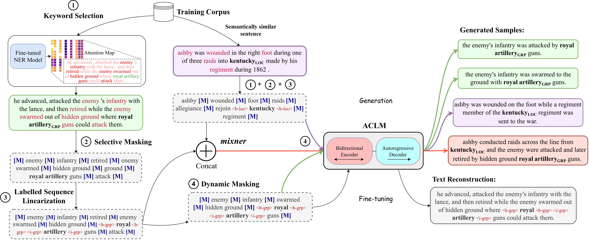

# ACLM

Implementation of [ACLM: A Selective-Denoising based Generative Data Augmentation Approach for Low-Resource Complex NER](https://arxiv.org/abs/2306.00928)



**Steps:**

1. Installing dependencies using:
```
pip install -r requirements.txt
```

2.
```
cd ./src
```

3. Run the required sh files
```
sh train_dynamic_multilingual.sh <language> <language label> <size of dataset> <flair batch size> <seed> <masking rate> <number of generations>

For mixner:
sh train_dynamic_multilingual_mixner.sh <language> <language label> <size of dataset> <flair batch size> <seed> <masking rate> <number of generations>

Example:

sh train_dynamic_multilingual.sh zh zh_CN 100 8 42 0.3 5
sh train_dynamic_multilingual_mixner.sh zh zh_CN 100 8 42 0.3 5
```


Languages Used and their keys:
German (de_DE), English (en_XX), Spanish (es_XX), Hindi (hi_IN), Korean (ko_KR), Dutch (nl_XX), Russian (ru_RU), Turkish (tr_TR), Chinese (zh_CN), Bengali (bn_IN)


**Please cite our work:**
```
@misc{ghosh2023aclm,
      title={ACLM: A Selective-Denoising based Generative Data Augmentation Approach for Low-Resource Complex NER},
      author={Sreyan Ghosh and Utkarsh Tyagi and Manan Suri and Sonal Kumar and S Ramaneswaran and Dinesh Manocha},
      year={2023},
      eprint={2306.00928},
      archivePrefix={arXiv},
      primaryClass={cs.CL}
}
```